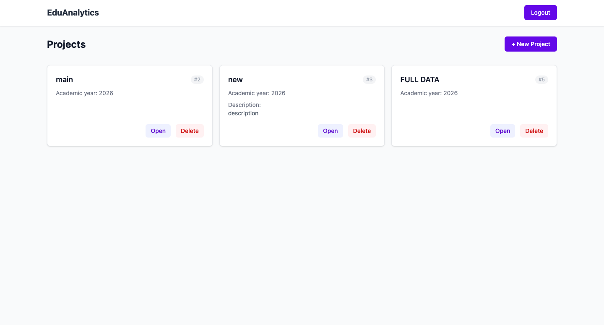
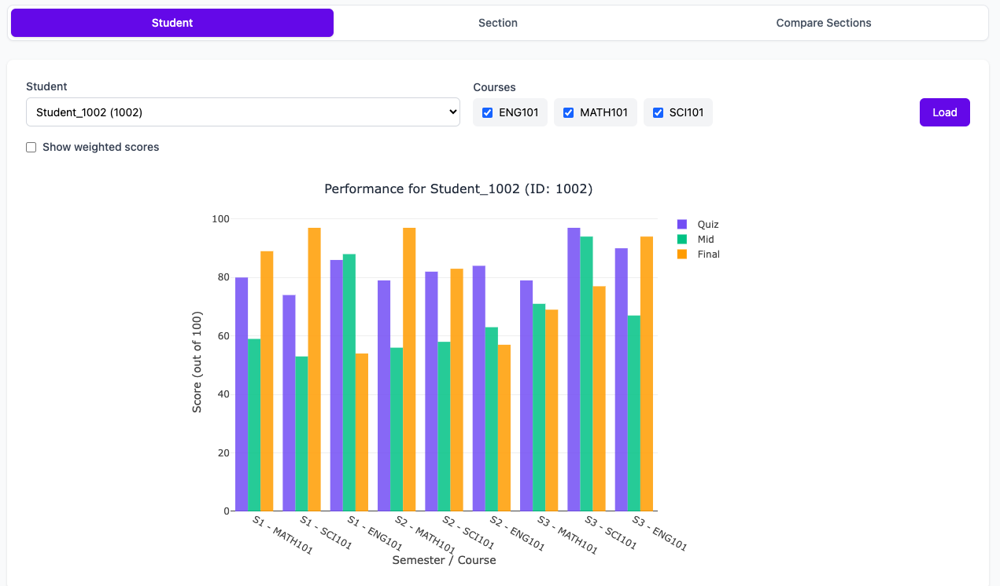
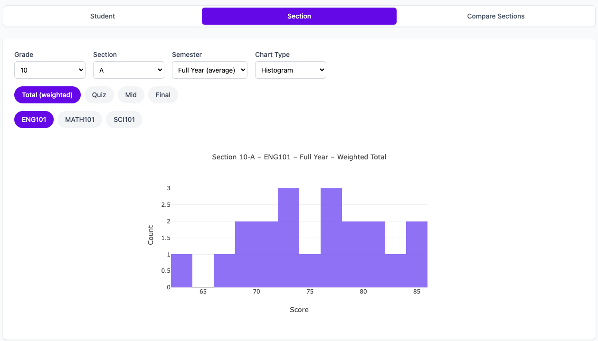
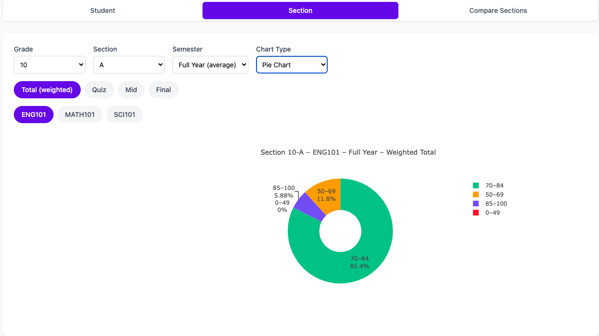
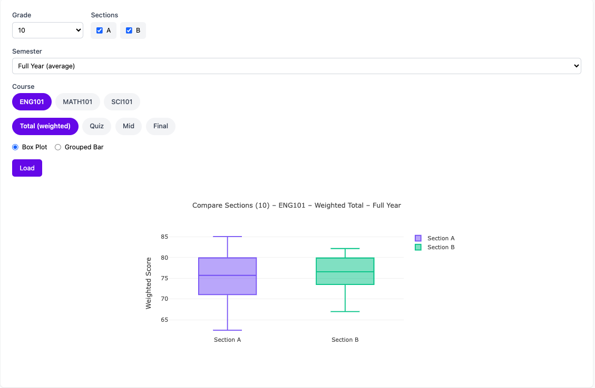
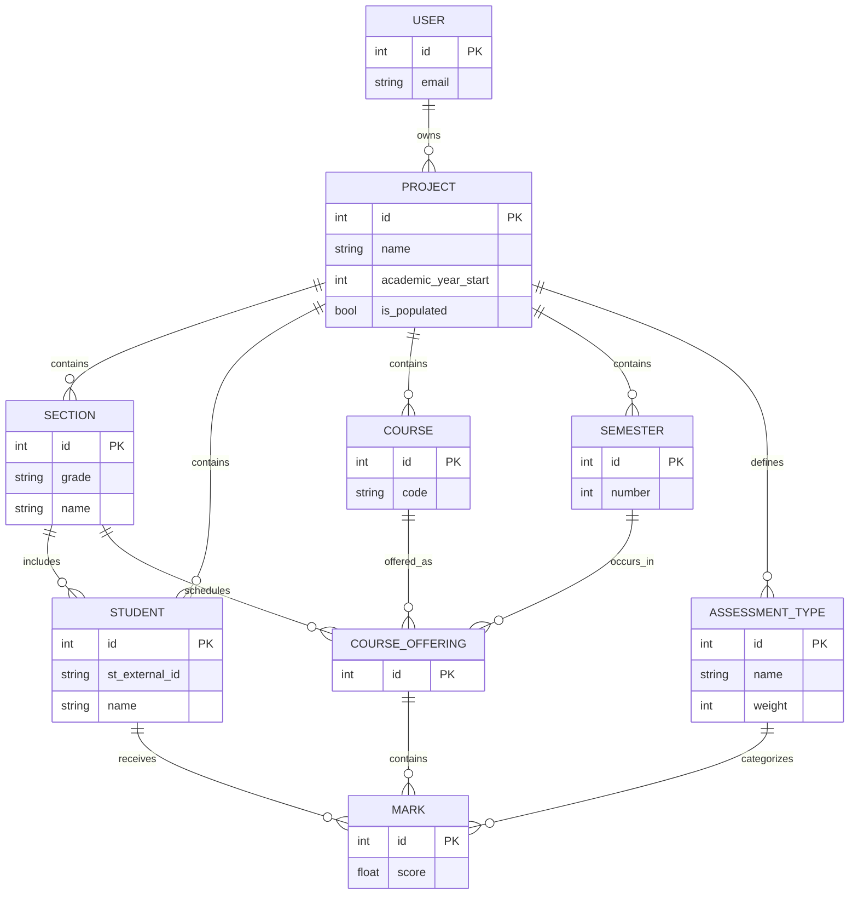

# EduAnalytics

> A web-based academic analytics platform for analyzing student performance from spreadsheet-based datasets using reusable academic-year projects and configurable assessment structures.

---

## Overview

Many schools and educators still rely on ad-hoc Excel workflows to analyze student grades, generate comparisons, and visualize academic performance. These processes are often repetitive, manual, and difficult to reuse across academic years.

EduAnalytics addresses this by providing a structured analytics system where users can:

- Create isolated academic-year projects
- Configure assessment types and grading weights
- Upload standardized Excel datasets
- Generate reusable analytics and visualizations

The platform supports analytics at multiple levels, including:

- Individual students
- Sections/classes
- Cross-section comparisons
- Course-level performance
- Semester-based analysis

---

## Features

- **Zero-configuration data ingestion**  
  Automatically detects students, sections, semesters, and courses from uploaded Excel files.

- **Flexible assessment configuration**  
  Configure custom assessment types and weights per academic project.

- **Academic-year isolation**  
  Organize and analyze datasets independently by project and academic year.

- **Rich analytics and visualization**  
  Interactive charts and distributions for student, section, and comparative performance analysis.

- **Project management**  
  Create, manage, populate, and delete academic datasets.

- **Secure backend architecture**  
  JWT authentication, rate limiting, upload protection, and hardened security headers.

---

## Screenshots


### Dashboard



### Student Analytics



### Section analytics






### Sectionwise Comparison



---

## Tech Stack

| Layer | Technology |
|---|---|
| **Frontend** | React 18, TypeScript, Vite |
| **Styling** | Tailwind CSS |
| **Charts** | Plotly.js (`react-plotly.js`) |
| **Backend** | FastAPI (Python 3.10+) |
| **Database** | PostgreSQL / SQLite (`SQLModel`) |
| **Authentication** | JWT (`python-jose`) |
| **Testing** | Pytest |
| **Rate Limiting** | `slowapi` |
| **Excel Processing** | `pandas`, `openpyxl` |

---

## System Workflow

```text
Create Project
    ↓
Configure Assessment Types & Weights
    ↓
Upload Excel Dataset
    ↓
Automatic Data Extraction & Population
    ↓
Analyze Students / Sections / Courses
```

---

## Project Structure

```text
EduAnalytics/
├── backend/
│   ├── app/
│   │   ├── api/
│   │   │   └── endpoints/
│   │   │       ├── analytics.py
│   │   │       ├── auth.py
│   │   │       └── projects.py
│   │   ├── core/
│   │   │   └── security.py
│   │   ├── repos/
│   │   ├── schemas/
│   │   ├── services/
│   │   ├── models.py
│   │   ├── db.py
│   │   └── main.py
│   ├── tests/
│   │   ├── test_auth.py
│   │   └── test_projects.py
│   └── requirements.txt
│
├── frontend/
│   ├── public/
│   ├── src/
│   │   ├── api/
│   │   ├── auth/
│   │   ├── components/
│   │   ├── pages/
│   │   ├── App.tsx
│   │   └── main.tsx
│   ├── package.json
│   └── vite.config.ts
│
└── README.md
```

---

## Database Schema (ERD)



---

## Getting Started

### Prerequisites

- Python 3.10+
- Node.js 18+ and npm
- PostgreSQL *(optional — SQLite works out of the box)*

---

## Installation

### Backend

```bash
cd backend

python -m venv venv

# Linux / macOS
source venv/bin/activate

# Windows
venv\Scripts\activate

pip install -r requirements.txt
```

### Frontend

```bash
cd frontend
npm install
```

---

## Environment Variables

Create a `.env` file inside the `backend/` directory:

```env
DB_TYPE=sqlite
SECRET_KEY=your-random-secret-key
ALGORITHM=HS256
EXPIRATION_TIME=60
ADMIN_TOKEN=some-admin-token
```

### PostgreSQL Configuration

```env
DB_TYPE=postgres
POSTGRES_USER=your_user
POSTGRES_PASSWORD=your_password
POSTGRES_HOST=localhost
POSTGRES_PORT=5432
POSTGRES_DB=eduanalytics
```

---

## Running the Application

### Start Backend

```bash
cd backend
uvicorn app.main:app --reload
```

Backend runs at:

- API: `http://localhost:8000`
- Interactive Docs: `http://localhost:8000/docs`

### Start Frontend

```bash
cd frontend
npm run dev
```

Frontend runs at:

- UI: `http://localhost:5173`

---

## API Endpoints

### Authentication

| Method | Path | Description |
|---|---|---|
| POST | `/auth/signup` | Register a new user |
| POST | `/auth/login` | Authenticate user and receive JWT token |

### Projects

| Method | Path | Description |
|---|---|---|
| GET | `/projects` | List user projects |
| POST | `/projects` | Create project and assessment types |
| GET | `/projects/{id}` | Retrieve project details |
| DELETE | `/projects/{id}` | Delete project and related entities |
| GET | `/projects/{id}/template` | Download Excel template |
| POST | `/projects/{id}/populate` | Upload and populate project data |
| GET | `/projects/{id}/students` | List project students |
| GET | `/projects/{id}/courses` | List courses |
| GET | `/projects/{id}/assessment-types` | List assessment types |
| GET | `/projects/{id}/sections` | List sections |

### Analytics

| Method | Path | Description |
|---|---|---|
| POST | `/projects/{id}/analytics/student-performance` | Student performance analytics |
| POST | `/projects/{id}/analytics/section-scores` | Section score distributions and weighted totals |

---

## Testing

Backend tests are implemented using **Pytest**.

```bash
cd backend
pytest -v
```

Test coverage includes:

- Authentication
- Project CRUD operations
- File upload validation

A fresh SQLite database is created for each test run.

---

## Security

The backend includes several security-focused protections and validation layers:

- JWT-based authentication with bcrypt password hashing
- Project ownership authorization checks
- IP-based rate limiting using `slowapi`
- Per-user project limits
- File upload validation and zip-bomb protection
- Hardened security headers
  - `X-Content-Type-Options: nosniff`
  - `X-Frame-Options: DENY`
- Strict request validation using Pydantic schemas
- Frontend-restricted CORS configuration

---

## Repository

```text
GitHub: https://github.com/AbdulRahmanLuai/EduAnalysis
```

---

## Author

```text
Name: Abdul Rahman Abu Nabhan
GitHub: https://github.com/AbdulRahmanLuai
```